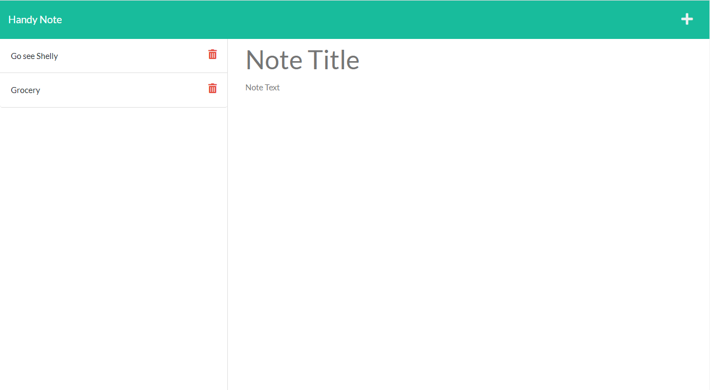

# Handy Note

## License
  [](https://opensource.org/licenses/MIT)

## Table of Contents

[Description](#description)

[Installation](#installation)

[Usage](#usage)

[Test](#test)

[Screenshot](#screenshot)

[Contributors](#contributors)

## Description

This is a simple note taking app for users to use within HTML environment. Users are able to input title of the note, text content and save them to the side bar on the left. On clicking, the note will display on the right side. On clicking the plus icon while viewing notes, user can add a new note. On clicking the trash can icon, users are able to delete notes. 


This application was made using JavaScript, HTML, CSS, Node JS, and NPM Packages.

## Installation

  For Installation, you are required the following:
  - Node JS 
  - Browser of Choice (to display html page)
  
  Additional packages required are: 
  - Node Packet Manager(NPM):
    - NPM [Inquirer package](https://www.npmjs.com/package/inquirer)
    - NPM [File System](https://www.npmjs.com/package/file-system)
    - NPM [Path](https://www.npmjs.com/package/path)
    - NPM [Router](https://www.npmjs.com/package/router)
    - NPM [UUID](https://www.npmjs.com/package/uuid)

  You can install the above required packages by entering following on the terminal/node:
  ```
    npm init -y 
    npm install
  ```
## Usage

Simply start using the application by clicking below link. 
[Handy Note](https://lit-tor-53201.herokuapp.com/)

## Test

no testing was done for this project please feel free to add the feature or contact me. 

## Screenshot



## Contribution

Joe Lee 

Got any questions or want to contribute to this project? 

Contact me via: 

  - [Jollypong](https//:github.com/Jollypong) 

  - Email: joeleegc@gmail.com

## 
